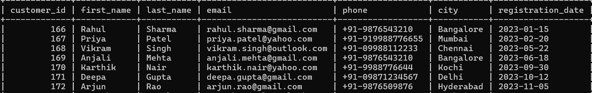
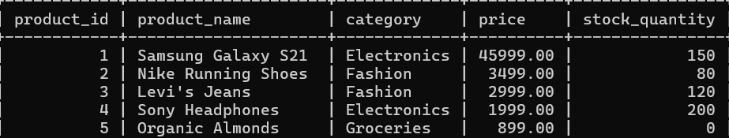
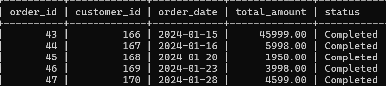
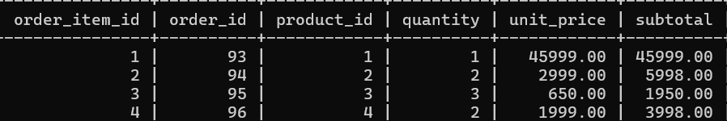

1. Entity–Relationship Description

ENTITY: customers
Purpose: Stores customer information for FlexiMart users.
Attributes:
customer_id (PK): Unique auto-increment identifier for each customer
first_name: Customer’s first name
last_name: Customer’s last name
email: Unique email address used for communication
phone: Contact number in standardized format
city: Customer’s city
registration_date: Date when customer registered
Relationships:
One customer can place many orders (1:M relationship with orders)

ENTITY: products
Purpose: Stores product catalog details.
Attributes:
product_id (PK): Unique product identifier
product_name: Name of the product
category: Product category
price: Selling price
stock_quantity: Available stock
Relationships:
One product can appear in many order_items (1:M)

ENTITY: orders
Purpose: Stores order-level transaction details.
Attributes:
order_id (PK): Unique order identifier
customer_id (FK): References customers.customer_id
order_date: Date of order
total_amount: Total order value
status: Order status
Relationships:
One order belongs to one customer
One order can have many order_items

ENTITY: order_items
Purpose: Stores individual items within an order.
Attributes:
order_item_id (PK): Unique identifier
order_id (FK): References orders.order_id
product_id (FK): References products.product_id
quantity: Units sold
unit_price: Price per unit
subtotal: Quantity × unit_price

2. Normalization Explanation (3NF)

The database schema follows Third Normal Form (3NF). Each table stores data related to a single entity, and all non-key attributes depend only on the primary key. There are no partial dependencies because each table uses a single-column primary key. There are no transitive dependencies, as non-key attributes do not depend on other non-key attributes.
For example, customer contact details are stored only in the customers table, and product pricing details are stored only in the products table. Order-level information is separated from order item details, avoiding redundancy. This design prevents update anomalies (changing customer details in one place), insert anomalies (adding products without orders), and delete anomalies (deleting an order does not remove customer data). Therefore, the schema satisfies 3NF requirements.

3. Sample Data Representation
->customers

->products

->orders

->order_items
